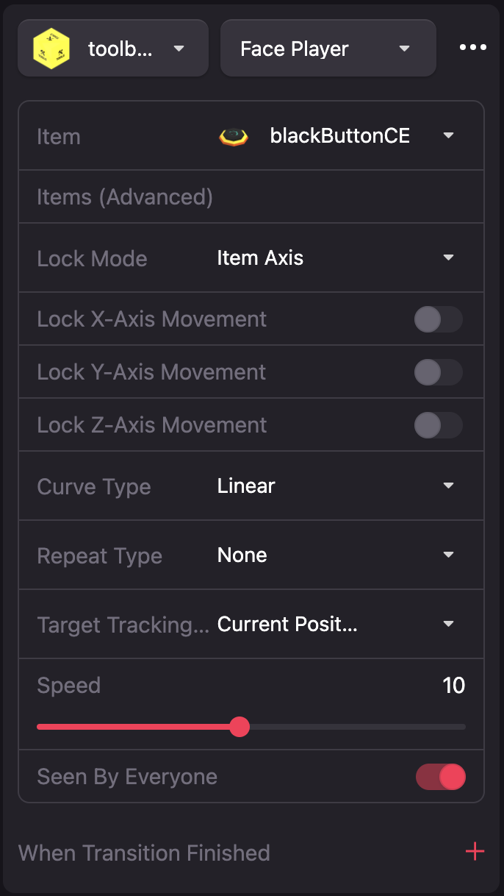
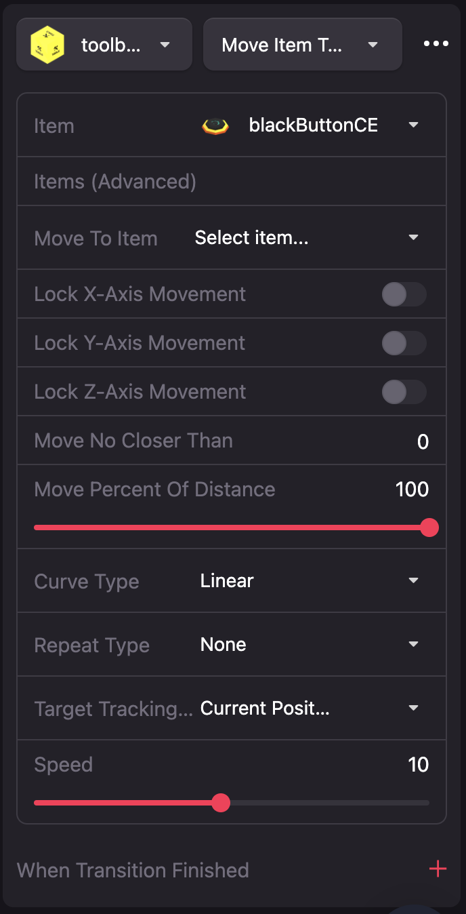
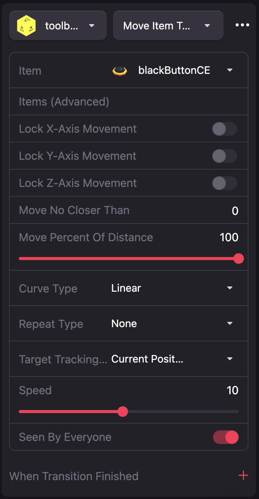

# Smart Item: Toolbox CE

Here you can find feature decriptions here. Here you'll find links to:

- [Face Player](#Face-Player) 
- [Face Item](#Face-Item) 
- [Move to Player](#Move-to-Player) 
- [Move to Item](#Move-to-Item) 
- [Follow Path of Items](#Follow-Path-of-Items) 
- [Scene Add/Remove](#Scene-Add/Remove) 
- [Attach To Item](#Attach-To-Item) 
- [Detach From Item](#Detach-To-Item) 
- [Motion Control](#Motion-Control) 

## Thank You!

Thank you to everyone who voted!  The enhancements to this smart item were made possible by all those who voted for this grant.    [Grant Here](https://governance.decentraland.org/en/proposal/?id=ba798f30-d382-11eb-b705-3db38bad850a)

<!--
If you can think of an example that is easy to understand and covers valuable topics that aren't covered here, you're encouraged to create a **Pull Request** and [contribute](https://github.com/decentraland-scenes/Awesome-Repository/blob/master/CONTRIBUTING.md)!
-->

If something doesn’t work, please [file an issue](https://github.com/wacaine/dcl-smart-items-ce/issues/new).

## Builder Buggyness

Builder is running SDK 6.6.3 (not the latest).  The latest SDK is 6.6.5.  [More on that here](https://governance.decentraland.org/en/proposal/?id=72f3d560-d1f4-11eb-9861-ebb8fcfd58d2).   There are a few things Builder does not do right like rotation.  While I try to get workarounds for issues like these please do not think its broke.  When deployed on the latest SDK it works correctly

#### Known issues:

* Face Player + Face Item using Mode: Scene Axis does not work correctly.  Mode: 

<!--
## FAQs

[Read the FAQs](https://github.com/decentraland-scenes/Awesome-Repository/blob/master/FAQ.md)

Check the Forum
Visit the Discord channel

-->

## Features

### Face Player

The target item will rotate towards the player at a configurable speed for how fast it rotates and stops when facing the player.  The position the item rotates is the position the player was at time of triggering, not where the player moves to afterwards.

| Parameter                            | Description                                                                                                                      |
| ------------------------------------ | -------------------------------------------------------------------------------------------------------------------------------- |
| Item                                 | Item to face player |
| Lock Mode                            | If you choose to lock rotation by x,y,z below defines how.  Item Axis - will lock rotation based on the center of the item how ever its rotated; Scene Axis - will lock rotation relative to absolute x,y,z |
| Lock X                               | Prevent rotation on X axis per lock mode above |
| Lock Y                               | Prevent rotation on Y axis per lock mode above |
| Lock Z                               | Prevent rotation on Z axis per lock mode above |
| Curve type                           | Curve type is the rate at which the item rotates over time.  For example start off slow and speed up.  TODO LINK_TO_CURVE_TYPE_LIST |
| Speed                                | Overall speed for which the item rotates |
| When transition finished             | Select a whole set of new actions when this action completes |

### Face Item

The target item will rotate towards the item of interest at a configurable speed for how fast it rotates and stops when facing the item.  The position the item rotates is the position the item was at time of triggering, not where the item of interest moves to afterwards.

| Parameter                            | Description                                                                                                                      |
| ------------------------------------ | -------------------------------------------------------------------------------------------------------------------------------- |
| Item                                 | Item to face item of interest |
| Look At Item                         | Item to to be faced |
| Lock Mode                            | If you choose to lock rotation by x,y,z below defines how.  Item Axis - will lock rotation based on the center of the item how ever its rotated; Scene Axis - will lock rotation relative to absolute x,y,z |
| Lock X                               | Prevent rotation on X axis per lock mode above |
| Lock Y                               | Prevent rotation on Y axis per lock mode above |
| Lock Z                               | Prevent rotation on Z axis per lock mode above |
| Curve type                           | Curve type is the rate at which the item rotates over time.  For example start off slow and speed up.  TODO LINK_TO_CURVE_TYPE_LIST |
| Speed                                | Overall speed for which the item rotates |
| When transition finished             | Select a whole set of new actions when this action completes |

### Move to Item

The target item will move towards the target item at a configurable speed for how fast it moves and stops when at the target item.  The position the item moves to is the position the item was at time of triggering, not where the target item moves to afterwards.

| Parameter                            | Description                                                                                                                      |
| ------------------------------------ | -------------------------------------------------------------------------------------------------------------------------------- |
| Item                                 | Item to face item of interest |
| Lock Mode                            | If you choose to lock rotation by x,y,z below defines how.  Item Axis - will lock rotation based on the center of the item how ever its rotated; Scene Axis - will lock rotation relative to absolute x,y,z |
| Lock X                               | Prevent rotation on X axis per lock mode above |
| Lock Y                               | Prevent rotation on Y axis per lock mode above |
| Lock Z                               | Prevent rotation on Z axis per lock mode above |
| Move Percent of Distance                  | Percent of distance to move between start and end |
| Move No Closer Than                  | Item will move no closer than N units from end |
| Curve type                           | Curve type is the rate at which the item rotates over time.  For example start off slow and speed up.  TODO LINK_TO_CURVE_TYPE_LIST |
| Speed                                | Overall speed for which the item rotates |
| When transition finished             | Select a whole set of new actions when this action completes |

### Move to Player

The target item will move towards the player at a configurable speed for how fast it move and stops when arrived at the player.  The position the item moves is the position the player was at time of triggering, not where the player moves to afterwards.

| Parameter                            | Description                                                                                                                      |
| ------------------------------------ | -------------------------------------------------------------------------------------------------------------------------------- |
| Item                                 | Item to face player |
| Lock X                               | Prevent rotation on X axis per lock mode above |
| Lock Y                               | Prevent rotation on Y axis per lock mode above |
| Lock Z                               | Prevent rotation on Z axis per lock mode above |
| Move Percent of Distance                  | Percent of distance to move between start and end |
| Move No Closer Than                  | Item will move no closer than N units from end |
| Curve type                           | Curve type is the rate at which the item rotates over time.  For example start off slow and speed up.  TODO LINK_TO_CURVE_TYPE_LIST |
| Speed                                | Overall speed for which the item rotates |
| When transition finished             | Select a whole set of new actions when this action completes |

### Follow Path of Items

The target item will follow a path of defined items. This is like move to item however you list more than one item. It will also not follow the path strictly but more of a curved path AND rotate the object-oriented facing forward along the path. 

### Scene Add/Remove

Action will let you remove/add an object. Not the most elegant way to handle the user experience object/movement but has its uses. One is removed objects do not contribute to scene limitations and boost scene performance.

### Attach To Item

Will attach 1 item to another giving the attached item the position, rotation, scale of the target/host object. This is very useful to move items in one group instead of individually.

### Detach From Item

Will detach 1 item to another giving the attached item the position, rotation, scale of the target/host object. This is very useful to move items in one group instead of individually. 

### Motion Control

Allows a player to pause, stop, resume an action